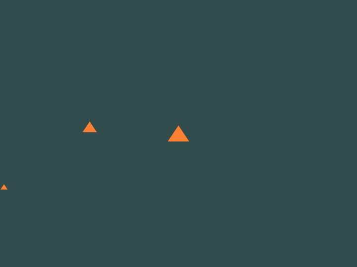
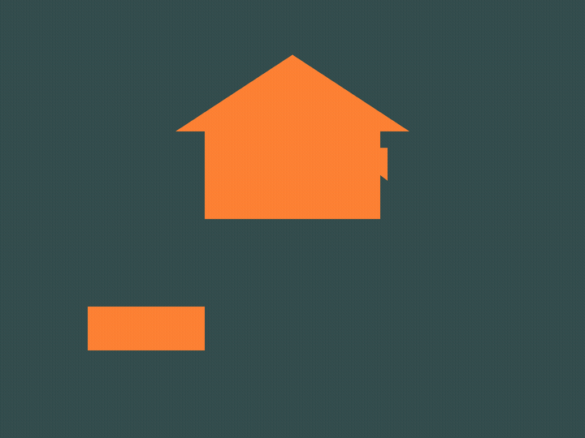

<div align="center">

# Computer Graphics Practices — OpenGL 3.3

Two hands-on OpenGL 3.3 exercises from a Computer Graphics course: primitive motion paths and GLM matrix transformations.

[](https://en.cppreference.com/w/cpp/17)
[](https://www.opengl.org/)
[](LICENSE)

</div>

---

## Exercise 1 — Triangle Motions

Three triangles, each following an independent path: Archimedean spiral, circular orbit, and sinusoidal sweep.

<div align="center">

</div>

| Triangle | Motion | Notes |
|----------|--------|-------|
| Large (center) | Archimedean spiral | Expands and contracts as angle grows |
| Medium (left) | Circle | Clockwise orbit around its origin |
| Small (right) | Sinusoid | Horizontal sweep with a `sin` curve |

Press `E` to start animation, `Tab` to select a triangle, `WASD` to move it manually.

---

## Exercise 2 — GLM Transformations

Three shapes demonstrating GLM matrix transformations in real time.

<div align="center">

</div>

| Shape | Transform | GLM call |
|-------|-----------|----------|
| House | Continuous rotation | `glm::rotate` |
| Square (top-right) | Scale pulse (breathe) | `glm::scale` |
| Rectangle (bottom-left) | Ping-pong translation | `glm::translate` |

---

## Build

Dependencies — GLFW 3.4, GLAD 2, and GLM 1.0.1 — are fetched automatically by CMake. No manual installs needed.

**Requirements:**
- CMake **≥ 3.24**
- A C++17 compiler (clang, gcc, or MSVC)
- Git
- A working OpenGL 3.3 driver (any modern GPU)

**Same commands on Linux, macOS, and Windows:**

```bash
git clone https://github.com/RayverAimar/Computer-graphics-practices.git
cd Computer-graphics-practices

cmake -B build -DCMAKE_BUILD_TYPE=Release
cmake --build build -j
```

The first configure takes ~1 minute while CMake downloads GLFW, GLAD, and GLM. Subsequent builds are incremental.

### Run

```bash
# Exercise 1 — triangle motions
./build/triangle-motions        # Linux / macOS
build\Release\triangle-motions.exe  # Windows

# Exercise 2 — GLM transformations
./build/house-transforms        # Linux / macOS
build\Release\house-transforms.exe  # Windows
```

### Platform notes

**macOS** — install the Xcode Command Line Tools once (`xcode-select --install`). Nothing else.

**Linux** — GLFW needs X11/Wayland headers. On Debian/Ubuntu:

```bash
sudo apt install xorg-dev libxkbcommon-dev libwayland-dev wayland-protocols \
                 libxrandr-dev libxinerama-dev libxcursor-dev libxi-dev \
                 libgl1-mesa-dev
```

**Windows** — Visual Studio 2022 (or Build Tools) provides the MSVC toolchain that CMake picks up automatically.

---

## Controls

| Key | Action |
|-----|--------|
| `E` | Start animation (exercise 1) |
| `Q` | Stop animation and reset |
| `Tab` | Cycle the active triangle |
| `W` `A` `S` `D` | Move active triangle |
| `T` | Draw mode: filled triangles |
| `P` | Draw mode: points |
| `Esc` | Quit |

---

## Project layout

```
Computer-graphics-practices/
├── main.cpp                        Exercise 1 — triangle motions
├── transformations.cpp             Exercise 2 — GLM transformations
├── include/
│   ├── object.h                    Base renderable: motion methods (spiral, circle, sinusoid)
│   ├── triangle.h                  Triangle geometry
│   ├── square.h                    Square geometry
│   ├── rectangle.h                 Rectangle geometry (2-triangle quad)
│   ├── house.h                     House geometry (3-triangle composite)
│   ├── open_gl_loader.h            GLFW window + GLAD context bootstrap
│   ├── shader.h                    GLSL program loader
│   ├── point.h / vector3d.h        3D math primitives
│   └── utils.h                     Screen size + shader path constants
├── utils/
│   ├── vertex_shader.vs            Pass-through vertex shader
│   ├── vertex_shader_transform.vs  Vertex shader with `transform` uniform (GLM)
│   └── fragment_shader.fs          Solid-color fragment shader
├── scripts/
│   └── record_gif.sh               Render both exercises to docs/*.gif via glReadPixels
└── CMakeLists.txt                  FetchContent build (GLFW 3.4 + GLAD 2 + GLM 1.0.1)
```

---

## Recording the GIFs

Both binaries support `--record <dir>` — they render 120 frames directly from the OpenGL framebuffer via `glReadPixels` and write PPM files, with no screen capture involved.

```bash
brew install ffmpeg     # macOS
sudo apt install ffmpeg # Linux

./scripts/record_gif.sh
# writes docs/triangles.gif and docs/transforms.gif
```

---

## License

[MIT](LICENSE)
