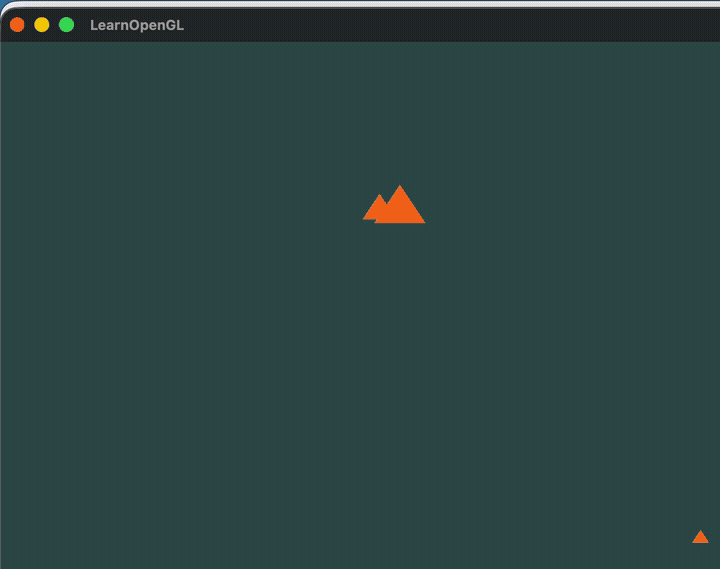

<div align="center">

# Triangle Motions — OpenGL 3.3

Three triangles, three independent motion paths — spiral, circular, and sinusoidal — rendered in real time with OpenGL 3.3 Core Profile. Built as a Computer Graphics course practice.

[](https://en.cppreference.com/w/cpp/17)
[](https://www.opengl.org/)
[](LICENSE)



</div>

---

## Motions

Each triangle follows an independent path that loops indefinitely once animation starts (`E`).

| Triangle | Path | Notes |
|----------|------|-------|
| Large (center) | Archimedean spiral | Expands and contracts as angle grows |
| Medium (left) | Circle | Clockwise orbit around its origin |
| Small (right) | Sinusoid | Horizontal sweep with a `sin` curve |

Press `Tab` to cycle the active triangle and move it manually with `WASD`.

## Build

Dependencies — GLFW 3.4 and GLAD 2 — are fetched automatically by CMake. No manual installs needed.

**Requirements:**
- CMake **≥ 3.24**
- A C++17 compiler (clang, gcc, or MSVC)
- Git
- A working OpenGL 3.3 driver (any modern GPU)

**Same three commands on Linux, macOS, and Windows:**

```bash
git clone https://github.com/RayverAimar/Computer-graphics-practices.git
cd Computer-graphics-practices

cmake -B build -DCMAKE_BUILD_TYPE=Release
cmake --build build -j
```

The first configure takes ~1 minute while CMake downloads GLFW and GLAD. Subsequent builds are incremental.

### Run

```bash
# Linux / macOS
./build/triangle-motions

# Windows
build\Release\triangle-motions.exe
```

### Platform notes

**macOS** — install the Xcode Command Line Tools once (`xcode-select --install`). Nothing else.

**Linux** — GLFW needs X11/Wayland headers. On Debian/Ubuntu:

```bash
sudo apt install xorg-dev libxkbcommon-dev libwayland-dev wayland-protocols \
                 libxrandr-dev libxinerama-dev libxcursor-dev libxi-dev \
                 libgl1-mesa-dev
```

**Windows** — Visual Studio 2022 (or Build Tools) provides the MSVC toolchain that CMake picks up automatically. No extra system packages.

## Controls

| Key | Action |
|-----|--------|
| `E` | Start animation |
| `Q` | Stop animation and reset motion state |
| `Tab` | Cycle the active (manually-controlled) triangle |
| `W` `A` `S` `D` | Move active triangle |
| `T` | Draw mode: filled triangles |
| `P` | Draw mode: points |
| `Esc` | Quit |

## Project layout

```
Computer-graphics-practices/
├── main.cpp                   Entry point, render loop, keyboard callbacks
├── include/
│   ├── open_gl_loader.h       GLFW window + GLAD context bootstrap
│   ├── shader.h               GLSL program loader (vertex + fragment)
│   ├── object.h               Base renderable with motion methods
│   ├── triangle.h             Triangle geometry built from Object
│   ├── point.h                3D point with arithmetic operators
│   ├── vector3d.h             3D vector wrapping Point
│   ├── utils.h                Screen size + shader path constants
│   └── star.h                 (unused, future practice)
├── utils/
│   ├── vertex_shader.vs       Pass-through vertex shader (OpenGL 3.3)
│   └── fragment_shader.fs     Solid-color fragment shader
└── CMakeLists.txt             FetchContent build (GLFW 3.4 + GLAD 2)
```

## License

[MIT](LICENSE)
